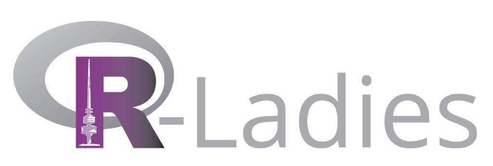

<!-- README.md is generated from README.Rmd. Please edit that file -->

# R-Ladies Canberra (Canberra, Australia)

R-Ladies Canberra welcomes members of all R proficiency levels, whether
you’re a new or aspiring R user, or an experienced R programmer
interested in mentoring, networking & expert upskilling. Our community
is designed to develop our members’ R skills & knowledge through social,
collaborative learning & sharing. Supporting minority identity access to
STEM skills & careers, the Free Software Movement, and contributing to
the global R community\!

A local chapter of R-Ladies Global, R-Ladies Canberra exists to promote
gender diversity in the R community worldwide. We are pro-actively
inclusive of queer, trans, and all minority identities, with additional
sensitivity to intersectional identities. Our priority is to provide a
safe community space for anyone identifying as a minority gender who is
interested in and/or working with R. As a founding principle, there is
no cost or charge to participate in any of our R-Ladies communities
around the world.

We are part of Global R-Ladies group. You can access our presentations,
R scripts, and Projects on our Github account and follow us on twitter
to stay up to date about R-Ladies news\!

# Event Notes

## [Beyond Beamer: Modern and Dynamic Presentations with R Markdown](https://github.com/Alice1969/RLadiesCanberra/tree/master/events/30_6_2020)

Speaker: [Emi Tanaka](https://emitanaka.org)

Tuesday, 30 June 2020
